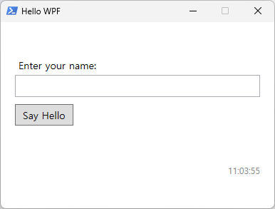
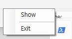

# WPF Scaffold for PowerShell

C# 없이 PowerShell만으로 WPF GUI 앱을 만드는 선언형 스캐폴드입니다.

UI는 XAML로 트레이와 타이머는 XML로 선언하고 로직은 `actions/` 폴더에 분리해 작성합니다.
`main.ps1`은 최초 실행 시 누락된 핸들러 파일을 자동으로 생성합니다.

## 프로젝트 구조

```
main.ps1                        엔진 — 수정 불필요
main.xaml                       WPF UI 레이아웃
tray.xml                        트레이 아이콘 및 컨텍스트 메뉴 정의
timers.xml                      DispatcherTimer 정의
actions/
    Initialize-Tray.ps1         tray.xml 파싱 및 트레이 초기화
    Initialize-Timers.ps1       timers.xml 파싱 및 타이머 초기화
    Show-Window.ps1             트레이 메뉴: 창 표시
    Stop-App.ps1                트레이 메뉴: 앱 종료
    Update-Clock.ps1            타이머 틱: 시계 레이블 갱신
    Invoke-HelloClick.ps1       버튼 클릭 핸들러
```

## 스크린샷





## 요구 사항

- Windows PowerShell 5.1 이상
- .NET Framework (Windows 기본 포함)

## 실행

```powershell
powershell -ExecutionPolicy Bypass -File main.ps1
```

## 동작 원리

1. `main.ps1`이 `main.xaml`을 파싱해 컨트롤 이름과 이벤트 핸들러 목록을 수집합니다.
2. `actions/` 폴더에 핸들러 파일이 없으면 자동으로 스텁을 생성합니다.
3. `actions/`의 모든 `.ps1` 파일을 dot-source로 로드합니다.
4. XAML을 로드하고 컨트롤을 변수에 바인딩한 뒤 이벤트 핸들러를 연결합니다.
5. `Initialize-Tray`와 `Initialize-Timers`가 각각 `tray.xml`과 `timers.xml`을 읽어 설정합니다.

## 트레이 동작

창 닫기 버튼을 누르면 앱이 종료되지 않고 시스템 트레이로 최소화됩니다.
트레이 아이콘은 PowerShell 기본 아이콘을 사용합니다.
트레이 아이콘을 더블클릭하면 창이 복원됩니다.
우클릭 메뉴는 `tray.xml`에서 선언합니다.

## 확장 방법

### 버튼 추가

`main.xaml`에 버튼을 추가하고 `Click` 속성에 핸들러 이름을 지정합니다.

```xml
<Button x:Name="btnSave" Content="저장" Click="Invoke-Save"/>
```

`main.ps1`을 실행하면 `actions/Invoke-Save.ps1`이 자동 생성됩니다.
생성된 파일에 로직을 작성합니다.

### 타이머 추가

`timers.xml`에 `<Timer>` 항목을 추가합니다.

```xml
<Timer Name="refreshTimer" Interval="5000" AutoStart="true" Tick="Invoke-Refresh"/>
```

`main.ps1`을 실행하면 `actions/Invoke-Refresh.ps1`이 자동 생성됩니다.
생성된 파일에 로직을 작성합니다.

### 트레이 메뉴 항목 추가

`tray.xml`에 `<MenuItem>` 항목을 추가합니다.

```xml
<MenuItem Header="설정" Action="Open-Settings"/>
```

`main.ps1`을 실행하면 `actions/Open-Settings.ps1`이 자동 생성됩니다.
구분선은 `Header="---"`로 추가합니다.
